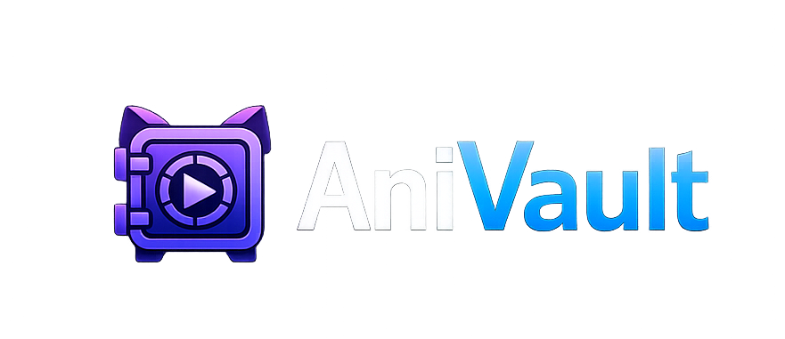

<p align="center">
  
</p>

<h1 align="center">
  
  AniVault
</h1>

<p align="center">
  <b>A modern Windows desktop anime library &amp; tracker.</b><br />
  Watches what you play, keeps your library organized, and syncs it all to AniList — automatically.
</p>

<p align="center">
  
  
  
  
  
  
</p>

---

> [!IMPORTANT]
> **This is an AI-generated project.** AniVault was designed, written, and is maintained with
> the assistance of AI (Anthropic's Claude). Treat it accordingly — review the code before
> relying on it, and expect the rough edges that come with automated development.

## What is AniVault?

AniVault is a lightweight, native Windows app that tracks the anime you watch and manages your
local collection. Leave it running in the tray and it **detects playback in your media player**,
recognizes the episode, advances your progress, and pushes the update to **AniList**, with no
manual logging. It also indexes your local video folders, maps files to their shows, and keeps a
calendar of upcoming episodes.

It's a clean-room reimagining of the classic [Taiga](https://github.com/erengy/taiga), rebuilt on a
modern stack (Rust + Tauri 2 + Svelte 5 + SQLite).

## Download

Grab the latest installer (`AniVault_<version>_x64-setup.exe`) from the
[Releases page](https://github.com/nosut/AniVault/releases/latest) and run it. To upgrade, install
over the previous version; your library is kept. AniVault shows a notice when a newer release is
available.

## Features

### 🏠 Home
- **Airing today**, with download status for each episode.
- **Ready to watch**: shows whose next episode is already on disk.
- **Missing downloads**, with a one-click request to Sonarr.
- **Jump back in** to the shows you're watching, refreshed live as you watch.

### 🎬 Automatic playback tracking
- Detects mpv, mpv.net, VLC, MPC-HC, MPC-BE, PotPlayer, SMPlayer, KMPlayer, GOM Player, Kodi,
  MPlayer and Windows Media Player, and recognizes the playing episode from its filename or window
  title, including season markers like `S02E05`.
- Advances progress, completes a series at its final episode, records it in your watch history,
  and queues the change for AniList.
- **Up Next**: when an episode ends, offers the next one, with a configurable minimum watch time.
- Low-confidence matches can be confirmed from Now Playing. Pause tracking any time from the tray.

### 📚 Local library
- Scan your anime folders; AniVault parses filenames (season/episode, release group, `SxxExx` and
  `1x01` formats) and matches each file to its show with a confidence score.
- Searchable, sortable **Library** in table or poster-grid layout, grouped by season, with a
  countdown to the next episode for shows you're watching.
- **Collection**: a poster wall or table of the series you have on disk, with disk usage per series.
- **File Manager** for bulk mapping, ignoring and removing indexed files, with a deep AniList match
  for tricky titles.
- Files deleted from disk are pruned on rescan, guarded so an offline drive never wipes your data.
- Readable English titles for entries AniList leaves untranslated, taken from the prequel's English
  title or AniDB. Nothing is machine-translated.


### 🔗 AniList integration
- OAuth sign-in and one-click import of your existing list.
- Progress, status and score changes sync to AniList in the background, retrying through outages.
  If your login expires, AniVault asks you to reconnect and syncs the queued changes afterwards.
- Rich detail pages: cover art, synopsis, progress and score editing, watch history, related
  entries, and next-airing countdowns.
- **Seasons** page to browse any season, with shows added since your last visit grouped at the top.
  

### 📅 Airing calendar
- Month grid **and** agenda views of upcoming episodes for the shows you follow, with a Today button.
- Episodes you've already watched are checked off.
- Sourced from AniList's airing schedule, with **Sonarr** as a fallback, and cached for offline use.

### 📺 Sonarr integration
- Connect your Sonarr instance to import series, matched automatically to your library.
- Choose which Sonarr tags to import from a list of your tags.
- See episode availability on a show's detail page, and request missing episodes from the home page.

### 📊 History &amp; stats
- Searchable watch history.
- Statistics, including your score distribution.

### 🗄️ Data safety
- Import from a legacy Taiga v1 installation.
- Back up and restore the database, and export or import your data as a JSON file.
- Secrets (AniList and Sonarr credentials) are encrypted at rest with Windows DPAPI.

### 🪟 Native desktop behavior
- System-tray icon, close-to-tray, and quit confirmation.
- Optional launch-on-startup, which repairs its own registry entry across reinstalls.
- Remembers the window's size and position, with a collapsible, reorderable sidebar and a
  choice of start page.

## Tech stack

| Layer | Technology |
|-------|-----------|
| Backend / engine | Rust, [Tauri 2](https://tauri.app/), `sqlx` (SQLite), `reqwest`, `tracing` |
| Frontend | Svelte 5, TypeScript, Vite |
| Storage | SQLite with versioned migrations |
| Secrets | Windows DPAPI |
| Packaging | NSIS installer |

## Building from source

Prerequisites: **Windows**, [Node.js](https://nodejs.org/), the
[Rust toolchain](https://rustup.rs/) with the MSVC build tools, and the Tauri CLI
(`cargo install tauri-cli --version "^2"`).

```powershell
cd next
npm install

cargo tauri dev   # run the desktop app in development (from next/)
npm run verify    # full check: type-check, svelte-check, Vitest, cargo check --tests
npm run bundle    # build the Windows installer (NSIS)
```

Individual checks:

```powershell
npm run test      # frontend tests (Vitest)
npm run check     # TypeScript type-check

cd src-tauri
cargo test                 # Rust unit and integration tests
cargo test --test <name>   # one integration test file
```

## Project structure

```
next/
├── src/            # Svelte frontend (TypeScript, Vitest)
├── src-tauri/      # Rust backend (Tauri 2)
│   ├── src/engine/ # scanner, parser, matcher, anilist, sonarr, migration, storage
│   ├── migrations/ # SQLite schema
│   └── tests/      # Rust integration tests
└── scripts/        # verify.ps1, bundle.ps1
```

## Credits

Inspired by and based on [Taiga](https://github.com/erengy/taiga) by
[Eren Okka](https://github.com/erengy). AniVault is an independent reimplementation and is not
affiliated with the original project.

## License

[GNU General Public License v3.0](LICENSE) — same license as the original Taiga.
